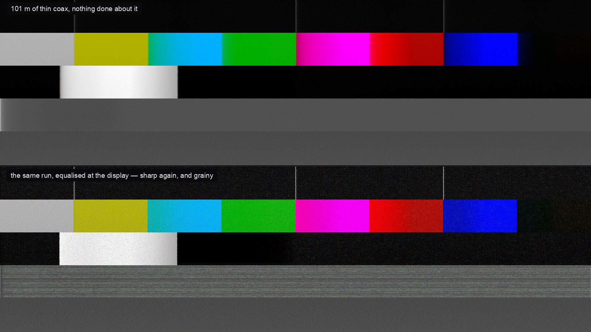

# 5-wire

> **AI-assisted project.** This codebase was created with [Claude](https://claude.com/claude-code)
> (Anthropic), directed and reviewed by a human author. The cable model is
> verified numerically by an offline harness that drives the real plugin class
> in a headless GL context: the response is checked against the square-root loss
> law it claims to obey, the equaliser is checked to be the inverse of it and
> never to make a picture softer, one bright column is put through the whole
> chain and compared against the C++ tap by tap, and the reflections are
> measured off the rendered frame against twice the cable's transit time (see
> [Status](#status)). It has **never been loaded into Resolume**, or into any
> FFGL host, and **no real cable run has been photographed and compared against
> it** — the physics is right, but whether the amounts match a particular lead
> on a particular floor is untested. Check it in your own rig before trusting it
> in front of an audience.

A long run of VGA or RGBHV, and the amplifier at each end of it, as an FFGL
effect for [Resolume](https://resolume.com) Arena and Avenue.

**Video:** [What it does, in 40 seconds](https://www.youtube.com/watch?v=CGt9p3fhMJc)
**Try it in your browser:** [5-wire-demo.stoatworks-labs.com](https://5-wire-demo.stoatworks-labs.com) — the plugin's own shaders, on real pixels.



<sub>Two renders of the plugin's own test card, both through the same 101 m of thin coax. The top
one has nothing done about it: the fine stripes have gone to flat grey because the cable ran out of
bandwidth before they did. The bottom is the same run with the equaliser at the display wound up —
the stripes are back, and so is the noise, because the equaliser sits after the point where the
noise joined the signal. Rendered by `fwtest`, the offline harness.</sub>

## The idea

**A cable is a filter, and the filter is not symmetric.**

Coax loses the *square root* of frequency — skin effect, which is why the
datasheets quote dB per 100 m at a frequency, and why doubling the bandwidth you
ask of a cable costs 41% more loss rather than twice as much. A square-root loss
has a closed-form step response, `erfc( α / 2√t )`, and three things about it
are the whole plugin:

- it is **strictly causal**, so a bright edge smears to the **right** and only to
  the right — that direction is the difference between "long cable" and "someone
  applied a blur";
- it has a **tail hundreds of pixels long**, which is what streaking *is*: the
  soft picture and the smear behind the caption are the same curve, not two
  effects;
- it has **one parameter**, from the cable type, the length and the pixel clock.

Everything else is a consequence of *where in the chain a thing joins the
signal*, rather than a control of its own:

| What you see | Why |
| --- | --- |
| A displaced repeat of the picture | Both ends are the wrong impedance. A ghost needs **two** mismatches — the far end to send it back and the amplifier to send it forward again — which is why a properly back-matched amplifier kills ghosting stone dead on an unterminated line. |
| Repeats that get softer the further out they land | Each bounce is two more trips down the same cable. A ghost as sharp as the picture is the clearest sign an effect drew it rather than derived it. |
| Coloured fringes on vertical edges | The three conductors are different lengths. Near-zero for five coaxes cut off one drum; tens of nanoseconds for a CAT5 balun, where the pairs are twisted at deliberately different rates and so genuinely differ in length. |
| Coloured **outlines**, but no colour cast on flat areas | Crosstalk couples a neighbour's *rate of change*, not its level. |
| Hum bars that **bend** the lines they cross | Hum is on the sync conductor too, not just the picture. |
| Jitter, and then a rolling frame | Sync came down the same cable, and the receiver ran out of margin. There is no Roll control. |
| A dark trail after a large bright area | The clamp failed, so the black level is following the picture's own average. |

## The argument

**Pre-Emphasis and Cable EQ are the same filter at opposite ends of the cable,
and they are not the same control.**

Both invert the cable. Both bring the picture back. But the noise, the
reflections and the crosstalk all join the signal *at the far end*:

- **Cable EQ** sits at the receiver, *after* them, and lifts them with the
  picture. A hundred metres equalised at the display is sharp **and grainy**,
  with the ghost lifted too.
- **Pre-Emphasis** sits at the amplifier, *before* them, and lifts nothing but
  the picture — paying in headroom instead, because it overshoots every edge and
  the overshoot meets the rail. That is what **Headroom** is, and why turning it
  down clips the whites.

That is why a real distribution amplifier offers both. Nothing in the plugin
asserts it; it comes out of the order of the passes.

The equaliser is calibrated in **metres**, exactly like the knob on a real cable
equaliser. Set **EQ Length** for the wrong length and you get the wrong answer in
the recognisable way: under-equalised is still soft, over-equalised rings and
puts a bright outline on the trailing side of every edge.

## Cables

| Type | What it stands for |
| --- | --- |
| **RGBHV Coax** | Five 75 Ω coaxes on BNC. What a fixed installation is made of, and near enough transparent at any length a room has. |
| **VGA Lead** | The moulded lead in the flight case: thin conductors, a foil wrap, a hood full of unshielded pigtails. Three times the loss of proper coax, and far more of the room gets in. |
| **Mini-Coax** | The compromise — real coax, but 28 AWG of it. |
| **CAT5 Balun** | UTP and passive baluns. The pairs are different lengths by design, which is why this one fringes colour that coax at the same length does not. |
| **Ribbon Loom** | No shield worth the name, conductors running parallel for their whole length. Which is the definition of a coupling capacitor. |

## Controls

**Cable** — Cable Type, Length, Pixel Clock, Termination, Ghosting, Bounces,
Skew, Crosstalk, Screening.
**Interference** — Noise, Hum, Mains, Ingress, Ingress Pitch.
**Sync** — Sync Level, Sync On Green, Jitter.
**Amplifier** — Gain, Red, Green, Blue, Pre-Emphasis, EQ Length, Headroom.
**Receiver** — Cable EQ, Output Gain, Black Level, DC Restore, Sample Phase.

Two are worth calling out because they are not what they look like:

- **Pixel Clock** is not decoration. Everything in the cable happens in *time*,
  and the pixel clock is the only thing that turns a nanosecond into a pixel —
  so the same 30 m lead is invisible at 640×480 and a plainly visible ghost at
  1600×1200.
- **Sample Phase** is the "auto adjust" button on the front of every VGA
  monitor. At the right phase the receiver samples where the signal has settled;
  half a pixel out it samples the transition, and fine detail loses contrast and
  shimmers.

## Presets

House Run · Long Haul · Equalised · Pre-Emphasised · Unterminated · Skip Lead ·
CAT5 Extender · Losing Sync · Tired Amp · Dead Run

The pairs are the point: **Long Haul**, **Equalised** and **Pre-Emphasised** are
the same hundred metres of cable with nothing done about it, fixed at the
display, and fixed at the amplifier.

<!-- downloads:start -->

## Download

**[v0.1.2](https://github.com/stoatworks-labs/5-wire/releases/tag/v0.1.2)** — prebuilt for macOS and Windows. Pick your platform:

<details>
<summary><b>macOS</b> — Universal (Apple Silicon + Intel)</summary>

| Build | Download | Size |
| --- | --- | --- |
| Universal (Apple Silicon + Intel) · .dmg disk image | [`5-wire-0.1.2-macos-universal.dmg`](https://github.com/stoatworks-labs/5-wire/releases/download/v0.1.2/5-wire-0.1.2-macos-universal.dmg) | 219 KB |
| Universal (Apple Silicon + Intel) · .zip archive | [`5-wire-macos-universal.zip`](https://github.com/stoatworks-labs/5-wire/releases/latest/download/5-wire-macos-universal.zip) | 181 KB |

</details>

<details>
<summary><b>Windows</b> — x64</summary>

| Build | Download | Size |
| --- | --- | --- |
| x64 · .exe installer | [`5-wire-0.1.2-windows-x86_64-setup.exe`](https://github.com/stoatworks-labs/5-wire/releases/download/v0.1.2/5-wire-0.1.2-windows-x86_64-setup.exe) | 222 KB |
| x64 · .zip archive | [`5-wire-windows-x86_64.zip`](https://github.com/stoatworks-labs/5-wire/releases/latest/download/5-wire-windows-x86_64.zip) | 116 KB |

</details>

All builds, checksums and release notes: [github.com/stoatworks-labs/5-wire/releases](https://github.com/stoatworks-labs/5-wire/releases).

macOS builds are signed and notarised and open normally. The Windows builds are unsigned, so SmartScreen warns once.

<!-- downloads:end -->

## Build

```
cmake -B build -DCMAKE_BUILD_TYPE=Release
cmake --build build
cmake --install build          # into ~/Documents/Resolume Arena/Extra Effects
```

macOS builds universal (arm64 + x86_64) by default. `-DCMAKE_OSX_ARCHITECTURES=arm64`
for a faster development build.

## Status

`tools/verify.sh` runs everything. What it establishes:

- **The response is a cable's.** Unit gain at DC to 1e-5, strictly one-sided,
  never negative, never rising with frequency, and a measured −3 dB point that
  tracks the analytic square-root law across the usable range.
- **The equaliser is the inverse of it.** Unit DC gain, exactly flat when off,
  monotonically worse as the run gets longer, a recoverable cable corrected to
  within 4% — and never, at any length, softer than the cable on its own.
- **End to end.** One bright column through the whole chain comes out equal to
  the C++ kernel to within a thousandth of a level on four different cables, and
  delivers 99% of the light that went in.
- **The repeats land where the transit time puts them**, within two pixels, at
  three lengths — and a back-matched amplifier produces none at all against an
  open far end.
- **All ten presets survive all three host behaviours**, including the one
  Resolume actually has (it ignores parameter value events, which is enough to
  break a preset system that looks perfectly correct).
- **All 30 controls change the picture.**
- The bundle exports `plugMain`, carries its own ID, names its own binary, and
  ad-hoc signs. The macOS build is universal by `lipo`.

Not established: it has never been loaded into Resolume or any other FFGL host;
nothing has been built for Windows or Linux; there is no OpenFX build; and the
cable *numbers* — loss, velocity, skew — are the manufacturers', but the
crosstalk, pickup and sync constants are calibrated by eye rather than measured.

## Documentation

- **[User guide](docs/USER-GUIDE.md)** — installing, what each control is for, and what to check when something looks wrong.
- **[AGENTS.md](AGENTS.md)** — the model, the load-bearing invariants and the traps. Read it before changing the cable.

## Licence

MIT. See [LICENCE](LICENSE) and [ATTRIBUTIONS.md](ATTRIBUTIONS.md).
